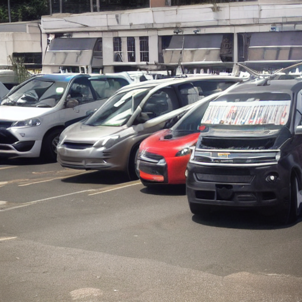
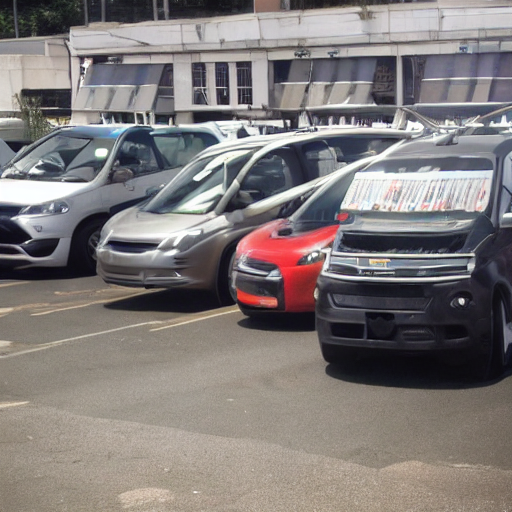
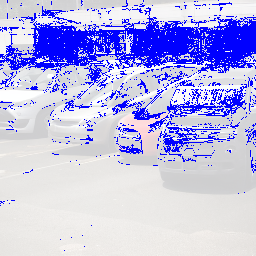
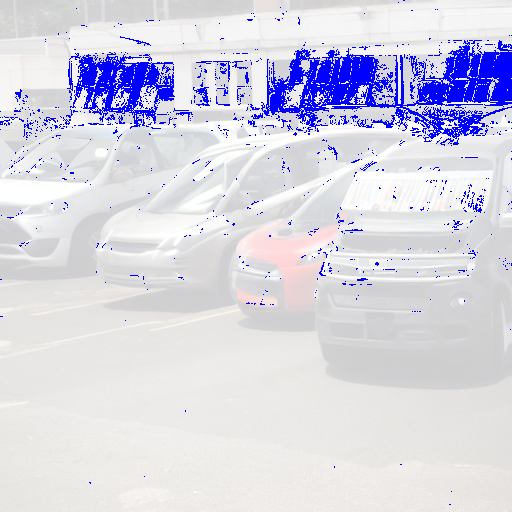

# Yet Another StableDiffusion Implementation
Stable Diffusion script(s) based on huggingface diffusers. Comes with extra configurability and some bonus features, a single script for accessing every functionality, and example code for a discord bot demonstrating how it can be imported in other scripts.
# Installation
## Install `pytorch` (skip when using a pre-existing StableDiffusion-compatible environment)
Get the correct installation for your hardware at https://pytorch.org/get-started/locally/.

When installing pytorch with CUDA support, the `conda` install command will install cudatoolkit as well.

When installing with `pip` directly (e.g. for non-conda environments), CUDA toolkit may also need to be manually installed. To install CUDA toolkit your device,  (https://developer.nvidia.com/cuda-downloads)
#
## Install additional dependencies
```shell
pip install diffusers==0.2.4 transformers scipy ftfy opencv-python huggingface_hub
```
Most pre-existing StableDiffusion-compatible environments will already have these, save for `huggingface_hub` and in some cases `diffusers`.
#
## Install models
Models can either be automatically installed by logging into your huggingface account with a token, or manually installed by downloading them from huggingface yourself. 
## Option A: Automatic model install via huggingface:
If you have not yet logged into huggingface-cli on your machine, run
```shell
huggingface-cli login
```
and paste a valid read token for your huggingface account (accessible at https://huggingface.co/settings/tokens). Your login should remain stored in your user directory until you log out with the cli, independent of your python environment.

## Option B: Manual model install:
- Log in at https://huggingface.co/CompVis/stable-diffusion-v1-4/
- Head to the `Files and versions` tab, and navigate to `stable-diffusion-v1-4/unet`
  - Download both `config.json` and `diffusion_pytorch_model.bin`
  - place both files in `models/stable-diffusion-v1-4/unet`
- Repeat for the VAE model: In the `Files and versions` tab, navigate to `stable-diffusion-v1-4/vae`
  - Download both `config.json` and `diffusion_pytorch_model.bin`
  - Place the files in `models/stable-diffusion-v1-4/vae`
- It is recommended to keep the branch on the default: `main` instead of switching to `fp16`. The fp32 weights are larger (3.44GB instead of 1.72GB), but can be loaded for both full precision (fp32) and half precision (fp16) use. 
- Note: The checkpoint files for diffusers are not the same as standard StableDiffusion checkpoint files (e.g. sd-v1-4.ckpt). They can not be copied over.

#
# Usage
- Features include text-to-image, image-to-image (including cycling), and options for precision/devices to control generation speed and memory usage.
- `prompts`, `seeds`, and other relevant arguments will be stored in PNG metadata by default.
- For every generated output, an image will be saved in `outputs/generated`. This can be modified using the global variable `OUTPUTS_DIR` near the top of `generate.py`. When multiple images are batched at once, this singular image will be a grid, with the individual images being saved in `outputs/generated/individual` (or {OUTPUTS_DIR}/individual). Additionally, each generated output will produce a text file in `outputs/generated/unpub` (or {OUTPUTS_DIR}/unpub) of the same filename, containing the prompt and additional arguments. This can be used for maintaining an external image gallery.
- The NSFW check is enabled by default, but will only print a warning message and attach a metadata label, leaving the output images untouched. It can also be fully disabled via a commandline flag (see: [Additional Flags](#additional-flags))
# 
## text to image
By default, `generate.py` will run in text-to-image mode. If launched without a prompt, it will enter a prompt input loop until the program is manually terminated. Alternatively a prompt can be specified as a commandline argument:
```shell
python generate.py "a painting of a painter painting a painting"
```
### Multiple prompts
- Multiple prompts can be specified this way, separated by two pipes (`||`). Any prompts specified this way will be multiplied by the set number of samples (`-n` or `--n-samples`). As all prompts and samples are run as a single batch, in parallel, increasing their amount will increase the memory requirement.
- For batch-processing a list of prompts, prompts can be specified from an input file via `-pf`/`--prompts-file`. Each line will be interpreted as one prompt, and prompts will be run sequentially.

### Image settings
- The flags `-W`/`--W` and `-H`/`--H` specify image resolution in width and height, respectively. Input values which are not divisible by 64 will be truncated to a multiple of 64 automatically.
### Diffusion settings
- `-S`/`--seed` will set the image seed. So long as the image size remains the same, keeping the seed should yield "the same image" under a similar prompt, or "a similar composition" under different prompts.
- `-s`/`--steps` will set the amount of diffusion steps performed. Higher values can help increase detail, but will be more computationally expensive.
- `-cs`/`--scale` sets the guidance scale. Increasing this value may make outputs more adherent to the prompt, while decreasing it may increase 'creativity'. The effect of different values will be different depending on the scheduler used.
- `-sc`/`--scheduler` sets the sampling scheduler. Currently, `"lms"`, `"pndm"` and `"ddim"` are implemented.
- `-e`/`--ddim-eta` sets the eta (η) parameter when the ddim scheduler is selected. Otherwise, this parameter is ignored. Higher values of eta will increase the amount of additional noise applied during sampling. A value of `0` corresponds to no additional sampling noise.
- `-es`/`--ddim-eta-seed` sets the seed of the sampling noise when a ddim scheduler with eta > 0 is used.
### Device settings
- `--unet-full` will switch from using a half precision (fp16) UNET to using a full precision (fp32) UNET. This will increase memory usage significantly. See section [Precision](#Precision).
- `--latents-half` will switch from using full precision (fp32) latents to using half precision (fp16) latents. The difference in memory usage should be insignificant (<1MB). See section [Precision](#Precision).
- `--diff-device` sets the device used for the UNET and diffusion sampling loop. `"cuda"` by default.
- `--io-device` sets the device used for anything outside of the diffusion sampling loop. This will be text encoding and image decoding/encoding. `"cpu"` by default. Switching this to `"cuda"` will increase VRAM usage (~7.32GB instead of ~6.45GB in the example shown in section [Precision](#Precision)), while only speeding up the (significantly less time intensive!) encode and decode operations before and after the sampling loop.
#
## image to image
When either a starting image (`-ii`, see below) or the image cycle flag (`-ic`, see below) are specified, `generate.py` automatically performs image-to-image generation.
### Image to image flags
- `-ii`/`--init-image` specifies the path to a starting image file. The image will automatically be scaled to the requested image size (`-H`/`-W`) before image-to-image is performed.
- `-st`/`--strength` specifies the 'strength' setting of image-to-image. Values closer to `0` will result in the output being closer to the input image, while values closer to `1` will result in the output being closer to the information of the newly generated image.
### Image to image cycling
When applying image-to-image multiple times sequentially (often with a lower strength), the resulting outputs can often be "closer" to the input image, while also achieving a higher "image quality" or "adherence to the prompt". Image-to-image cycling can also be applied without a starting image (the first image in the sequence will be generated via text-to-image) to create interesting effects.
- `-ic`/`--image-cycles` sets the amount of image-to-image cycles that will be performed. An animation (and image grid) will be stored in the `/animated` folder in the output directory. While running, this mode will attempt to display the current image via cv2. This can be disabled by setting the global variable `IMAGE_CYCLE_DISPLAY_CV2=False` near the top of `generate.py`
- `-cni`/`--cycle-no-save-individual` disables the saving of image-to-image cycle frames as individual images when specified.
- `-iz`/`--image-zoom` sets the amount of zoom applied between image-to-image steps. The value specifies the amount of pixels cropped per side. Disabled with a value of `0` by default.
- `-ir`/`--image-rotate` sets the amount of degrees of (counter-clockwise) rotation applied between image-to-image steps. Disabled with a value of `0` by default.
- `-it`/`--image-translate` sets the amount of translation applied to the image between image-to-image steps. This requires two values to be specified for the x and y axis translation respectively. Disabled with a value of `None` by default.
- `-irc`/`--image-rotation-center` sets the position of the rotational axis within the image in pixel coordinates, if rotations are applied. Requires two values for both x and y coordinates, with the origin `0,0` being the top left corner of the image. By default, this automatically selects the center of the image with a value of `None`.
- `-ics`/`--image-cycle-sharpen` sets the strength of the sharpening filter applied when zooming and/or rotating during image-to-image cycling. This filter is only applied to image inputs before the next cycle, not to stored image outputs. This can help preserve image sharpness, as the resampling applied when zooming or rotating will soften or blur the image. Values greater than `1.0` will increase sharpness, while values between `1.0` and `0.0` will soften the image. Default is `1.2`.
#
## Additional flags
- `--no-check-nsfw` disables the NSFW check entirely, which slightly speeds up the generation process. By default, `generate.py` will only display a warning and attach an extra tag in image metadata if potential NSFW concepts are detected.
- `--animate` will store any intermediate (unfinished) latents during the sampling process in CPU memory. After sampling has concluded, an animation (and image grid) will be created in the `/animated` folder in the output directory
- `-in`/`--interpolate-latents` accepts two image paths for retrieving and interpolating latents from the images. This will only work for images of the same size which have had their latents stored in metadata (`generate.py` does this by default, as it will only increase image size by 50-100kB). While the interpolation occurs in the latent space (after which the VAE is applied to decode individual images), results will likely not differ from crossfading the images in image space directly. Results are saved like in `--animate`.


# Precision
When switching the precision of either the unet or the latents between full (fp32) and half (fp16), there will be a small difference in outputs.

Switching from a half precision UNET to a full precision UNET will significantly increase the amount of memory required: ~9.15GB instead of ~6.45GB (overall usage) in the example shown below.
Switching from full precision latents to half precision latents should only reduce the memory usage by less than a megabyte.

The following examples all use the prompt "test one two" with a fixed seed of `-S 1`. The results are (in order):
- half(fp16) UNET and full(fp32) latents [`default`]
- half(fp16) UNET and half(fp16) latents [`--latents-half`]
- full(fp32) UNET and full(fp32) latents [`--unet-full`]
  
  

Visualization of the difference between outputs in this example (highlighting of pixels where the differences are greater than a 1% fuzz threshold):
- half(fp16) latents compared to full(fp32) latents (with UNET at full(fp32) precision)
- half(fp16) UNET compared to full(fp32) UNET (with latents at full(fp32) precision)

 

#
# Discord bot
**The included discord bot script is provided AS IS.** It is primarily intended to serve as an example, or as a starting point for custom bot scripts.
- `discord_bot.py` contains an example of a discord bot script, which imports functions from `generate.py` to perform both image-to-image and text-to-image generation. This example bot is not recommended for use outside of trusted, private servers in channels marked as NSFW.
- Outputs flagged as potentially NSFW will be sent as spoilers, however, this will likely not make them exempt from any content filters or rules.
- This script uses two threads, one for the discord bot itself, and one for running StableDiffusion. They communicate via queues of pending and completed tasks.
- Some basic settings (saving outputs to disk, precision, devices, command prefix) can be set using global variables at the top of the script.
- Available commands are specified via `@bot.slash_command("<command name>")`. Modifying the pre-existing commands to best serve your use-case is recommended.
- The bot utilizes the automatic switching to image-to-image present in `generate.py`. When one or more attachments are present, the first attachment of a command message will be utilized as the input for image-to-image.
- In case of an error, the bot should respond with an error message, and should continue to function.

## Installation
In addition to the dependencies used for `generate.py` (see [Installation](#installation)), the bot script requires [`py-cord`](https://github.com/Pycord-Development/pycord), a fork and continuation of `discord.py`. It can be installed via:
```shell
pip install -U py-cord
```
If `discord.py` is already installed in the environment, it will need to first be uninstalled before installing `py-cord` (both use the same `discord` namespace): 
```shell
pip uninstall discord.py
pip install py-cord
```

## Usage
- Set the bot token in `bot_token.py`.
- Start `discord_bot.py`. The bot should now be accessible to anyone with access to whichever channels the bot is present in.
- Example commands include:
  - `img>generate "<text prompt>"`
  - `img>portrait "<text prompt>"` (shortcut for 512x768 resolution images)
  - `img>landscape "<text prompt>"` (shortcut for 768x512 resolution images)
  - `img>generate_advanced "<text prompt>" <width> <height> <seed> <guidance_scale> <steps> <ddim_eta> <eta_seed> <img2img_strength>`
    - `Width` and `height` are specified as multiples of 64, offset from 512x512. A `width` of `3` and `height` of `-2` will result in an image which is `512+64*3 = 704` pixels wide and `512-64*2 = 384` pixels high
    - If seeds are set to a value below `0`, the seed is randomized. The randomly picked seed will be returned in the image response.
    - if `eta` is set to a value greater than `0`, the scheduler automatically switches to `ddim`. Otherwise, `pndm` is used.
    - Unless a source image is attached, `img2img_strength` is ignored.
    - Steps are limited to `150` by default.

#
# Notes
- For more information about [Stable Diffusion](https://github.com/CompVis/stable-diffusion) and the [Huggingface Diffusers Implementation](https://huggingface.co/CompVis/stable-diffusion-v1-4), including the license, limitations, and capabilities of the systems utilized, check out the respective links.
- The image to image implementation through diffusers is derived from the implementation in the following colab notebook: https://colab.research.google.com/github/patil-suraj/Notebooks/blob/master/image_2_image_using_diffusers.ipynb
